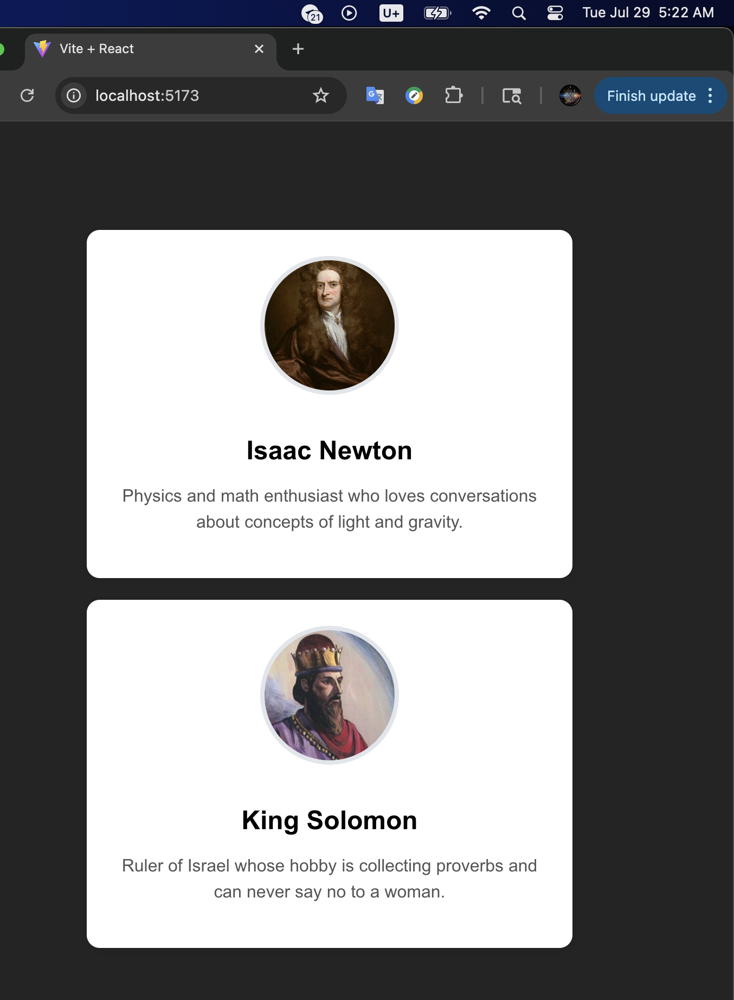

https://github.com/Greg01001000/module9a-firstreact
### CS 81, by Greg H, 7/29/25
# Module 9A - Build Your First React Component

## Description
This is a React app created using Vite that renders a UserProfile component. The component includes a name, bio, and image styled with inline CSS.

## What I Learned
- How to set up a React project using Vite
- How to write and structure a functional React component
- How to use JSX and inline styles
- How to render a component in App.jsx

## Challenges
Briefly describe any errors, bugs, or confusion you encountered and how you solved it.

The profile card wasn't centered on the page as expected. I added the line:

document.getElementById('root').style.margin = 'auto';

to the App function to solve that. Also, the name text did not show up because it was the same color as the card background. I added:

, color: 'black'

to the name styling to solve that. Also, I accidentally initialized my GitHub repo to the wrong local folder because the assignment instructions specified a GitHub repo name that was not similar to the intended project folder but was very similar to the first React project folder which I created while following the textbook's instructions. I eventually deleted all the files from my GitHub repo, removed the git files from the incorrect local folder, and initialized git and the remote repo to my correct local folder.

## Screenshot
Add a screenshot of your rendered component (you can drag and drop it here if using GitHub web interface).

# React + Vite

This template provides a minimal setup to get React working in Vite with HMR and some ESLint rules.

Currently, two official plugins are available:

- [@vitejs/plugin-react](https://github.com/vitejs/vite-plugin-react/blob/main/packages/plugin-react) uses [Babel](https://babeljs.io/) for Fast Refresh
- [@vitejs/plugin-react-swc](https://github.com/vitejs/vite-plugin-react/blob/main/packages/plugin-react-swc) uses [SWC](https://swc.rs/) for Fast Refresh

## Expanding the ESLint configuration

If you are developing a production application, we recommend using TypeScript with type-aware lint rules enabled. Check out the [TS template](https://github.com/vitejs/vite/tree/main/packages/create-vite/template-react-ts) for information on how to integrate TypeScript and [`typescript-eslint`](https://typescript-eslint.io) in your project.
